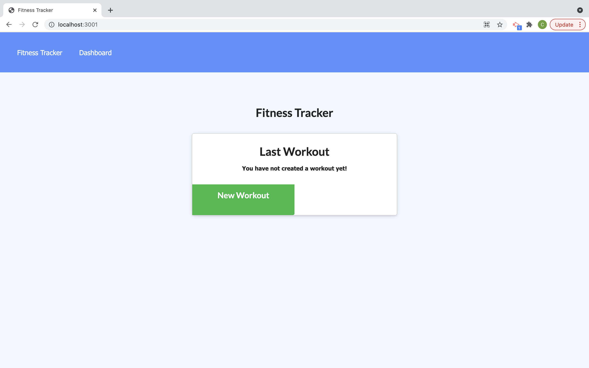
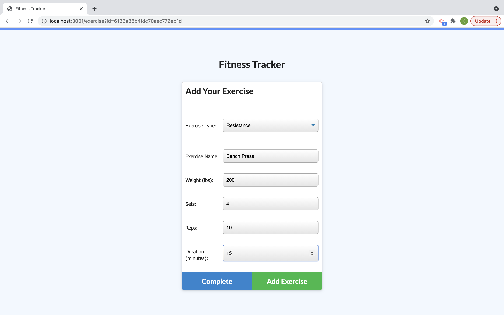
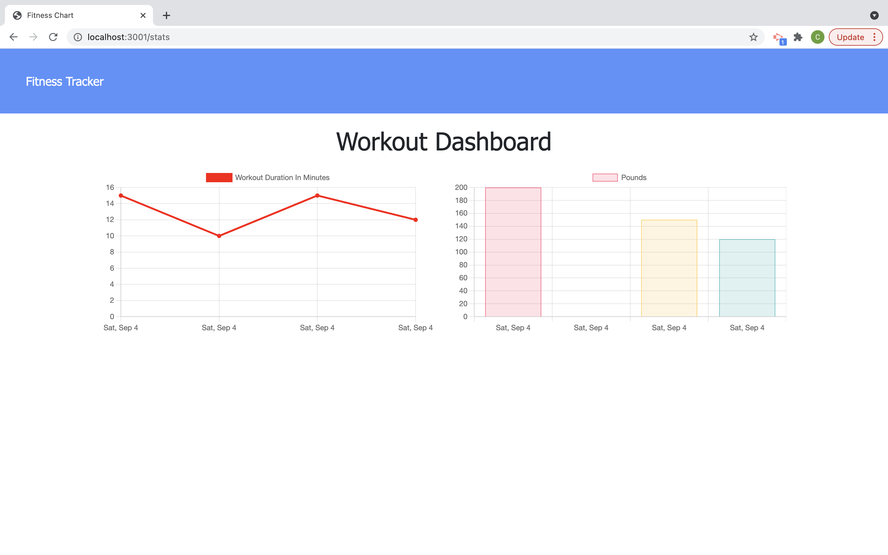

# Workout Tracker


This project is a workout tracker. This project is built with a Mongo database with a mongoose schema and an Express route handler. This app allows a user to be able to view, create and track daily workouts. They are able to log multiple exercises in a workout on a given day. The user can track the nae, type, weight, sets, reps and duration of an exercise. If the workout is a cardio exercise they can also track the distance traveled. 
 
  * [Installation](#install)
  * [Usage](#usage)
  * [View Heroku app here.](https://nameless-badlands-22446.herokuapp.com/)


## User Story

As a user, I want to be able to view create and track daily workouts. I want to be able to log multiple exercises in a workout on a given day. I should also be able to track the name, type, weight, sets, reps, and duration of exercise. If the exercise is a cardio exercise, I should be able to track my distance traveled.


## Install

Clone project.
Run the following line of code in your terminal to install all the needed packages: 
```
npm i
```
Then seed the database with the following line of code: 
```
npm run seed 
```


## Usage

Once all the packages have been installed, open terminal and run the following code in command line : 
```
node server.js
```
This application runs on localhost:3001. Open page and begin to track your workouts. Select New Workout, choose Resistance or Cardio. Fill in all the needed exercise information. When you are done click Complete to add the exercise to you app. To see stats click on Dashboard in the top left and view total weight of past 7 workouts as well as duration. 

## Built With
- HTML
- CSS
- Bootstrap 
- JavaScript
- Node.js
  - express
  - mongoose
  - morgan

## View




#### Credits
Frontend starting files provided © 2021 Trilogy Education Services, LLC, a 2U, Inc. brand. Confidential and Proprietary. All Rights Reserved.
